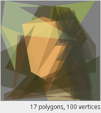

# Lab02: ВВЕДЕНИЕ В ЭВОЛЮЦИОННЫЕ ВЫЧИСЛЕНИЯ

## BitsCount

|Размерность|Run 1|Run 2|Run 3|Run 4|Run 5|Среднее|
|---|---|---|---|---|---|---|
| 20 | 21 | 26 | 34 | 27 | 28 | 27.2 |
| 50 | 1285 | 2206 | 869 | 1440 | 4470 | 2054 |
| 100 | 7536533 | 10198995 | 15803778 | 13327858 | 8187481 | 11010929.0 |

В данном алгоритме генотип (решения) закодирован битовыми строками (массивами) языка Java. По факту он представляет из себя интовый массив для лучшей работы с памятью (так утверждается в документрации).

Из-за недостатка определений, для ответа на вопрос о типе представления решений воспользуемся логикой (продлим аналогию с нейронок). Решение в задаче представляется битовым вектором, значит тип - бинарный.

## Travelling salesman problem

Opt = 10494.0km

|Selection|Population size|Elitism|NoG|Length|Path|
|---|---|---|---|---|---|
|Truncation|300|3|100|10976.0km|London -> Dublin -> Lisbon -> Madrid -> Paris -> Brussels -> Luxembourg -> Rome -> Athens -> Vienna -> Berlin -> Helsinki -> Stockholm -> Copenhagen -> Amsterdam -> London|
|Truncation|300|3|100|10494.0km|Vienna -> Berlin -> Helsinki -> Stockholm -> Copenhagen -> Amsterdam -> Brussels -> Luxembourg -> Paris -> London -> Dublin -> Lisbon -> Madrid -> Rome -> Athens -> Vienna|
|Truncation|500|3|100|10563.0km|Berlin -> Stockholm -> Helsinki -> Copenhagen -> Amsterdam -> Brussels -> Luxembourg -> Paris -> London -> Dublin -> Lisbon -> Madrid -> Rome -> Athens -> Vienna -> Berlin|
|Truncation|500|11|100|10494.0km|Helsinki -> Berlin -> Vienna -> Athens -> Rome -> Madrid -> Lisbon -> Dublin -> London -> Paris -> Luxembourg -> Brussels -> Amsterdam -> Copenhagen -> Stockholm -> Helsinki|
|Rank|500|3|100|10494.0km|Helsinki -> Berlin -> Vienna -> Athens -> Rome -> Madrid -> Lisbon -> Dublin -> London -> Paris -> Luxembourg -> Brussels -> Amsterdam -> Copenhagen -> Stockholm -> Helsinki|
|Roulette|500|3|100|11312.0km|Brussels -> Rome -> Athens -> Vienna -> Helsinki -> Stockholm -> Copenhagen -> Berlin -> Luxembourg -> Paris -> Madrid -> Lisbon -> Dublin -> London -> Amsterdam -> Brussels|

В данной задаче решения закодированны в виде связных списков строк, а расстояния вычисляются только в фитнесс-функции.

Тип структуры решений - комбинаторный. (Можно и целочисленный натянуть, но он звучит менее адекватно).

## Mona Lisa

|Решение|Итерация|Фитнесс|Кол-во полигонов и углов|Рисунок|
|---|---|---|---|---|
| плохое | 1975 | 374486 | 17/100 |  |
| среднее | 17526 | 231497 | 29/172 |  |
| хорошее | 60686 | 198968 | 39/314 |  |

В данном алгоритме генотипом является вектор из полигонов, каждый из которых описан 3 координатами вершин и цветом.
А фенотипом является отрендеренное изображение подобранных полигонов.

Полигон можно рассматривать как комбинаторный объект, а значит и структура решений задачи - комбинаторная.
